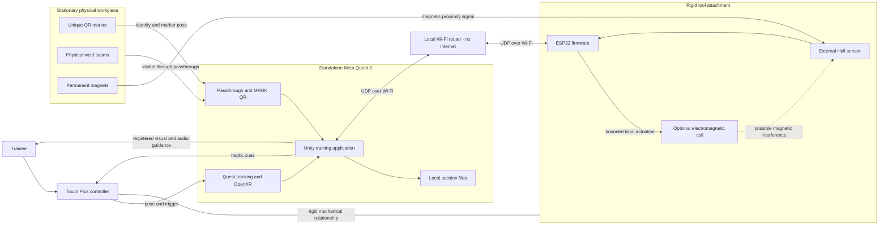
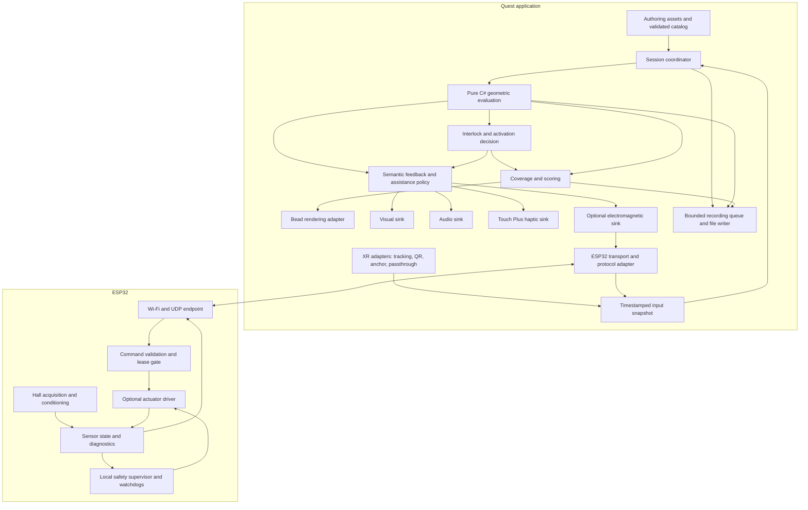
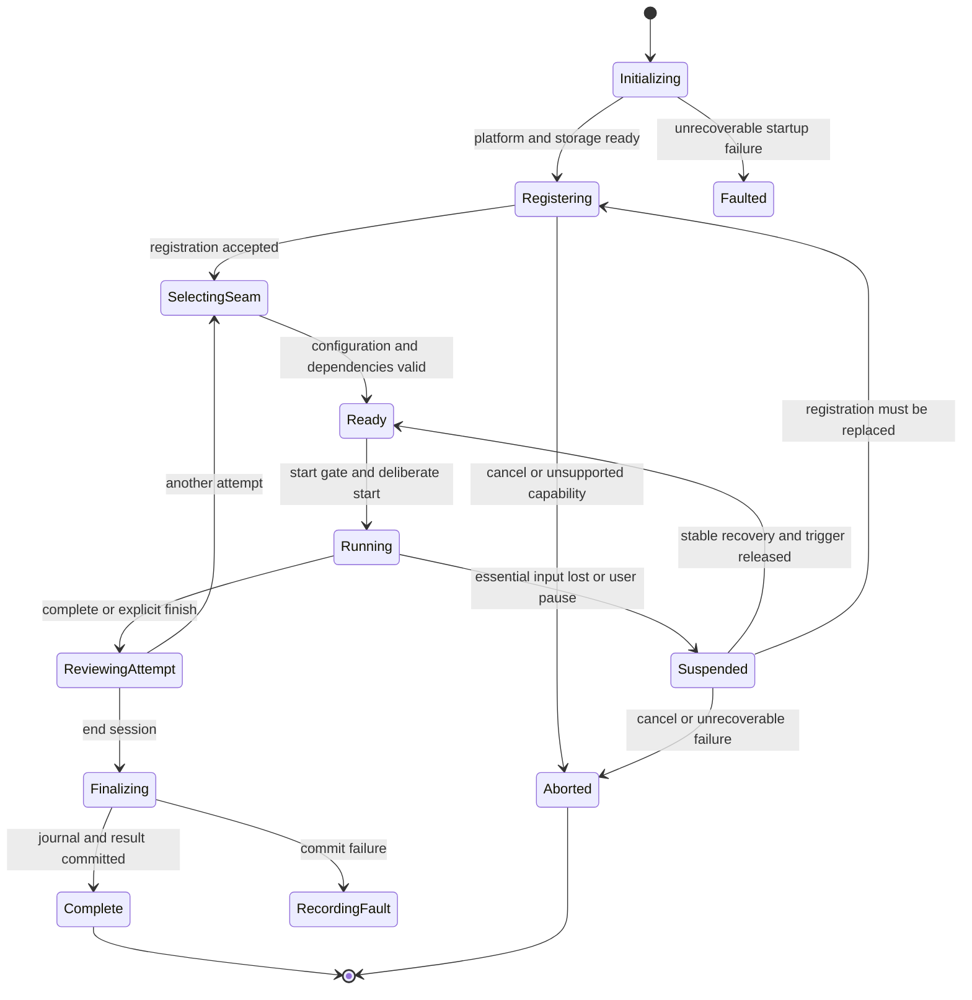
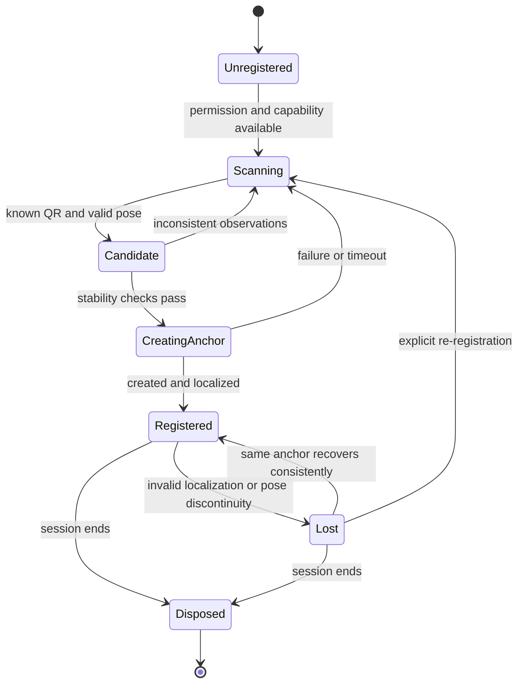
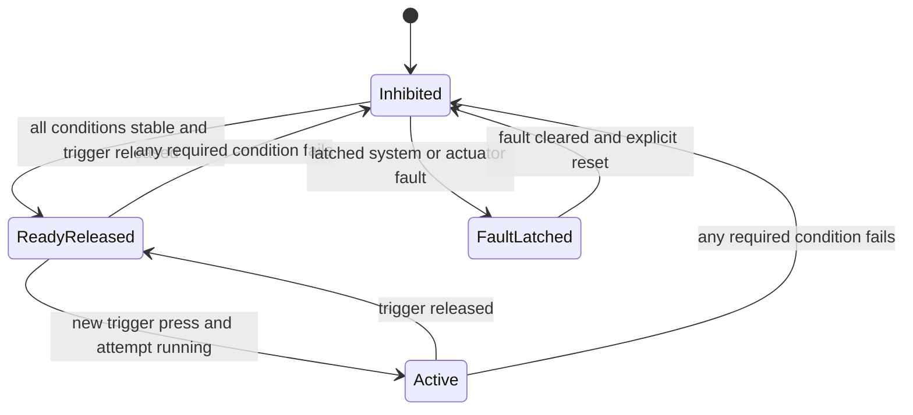
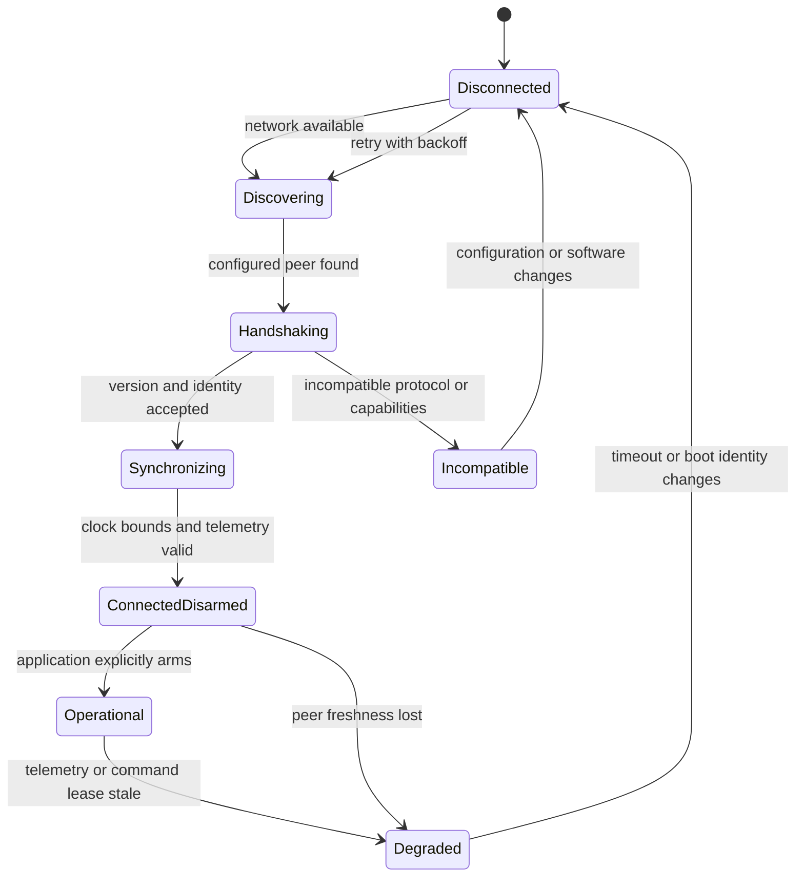
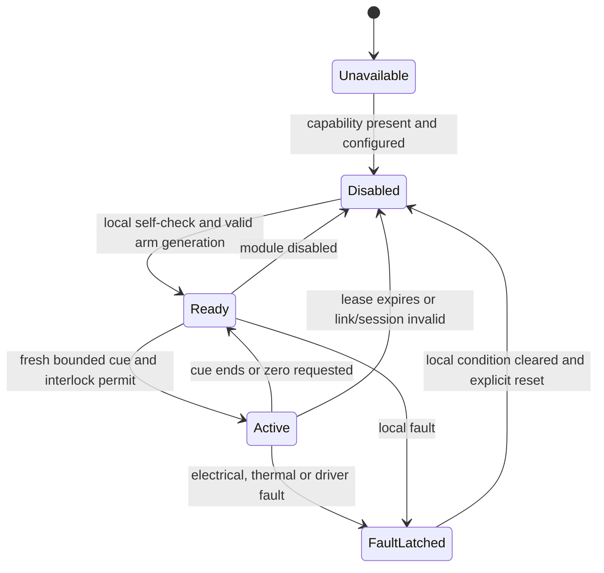

# Mixed-reality handheld laser-welding training system — project description and software architecture

**Project baseline:** 17 September 2026. **Target:** standalone Meta Quest 3 with one permanently paired ESP32 connected through an external local Wi-Fi router with no Internet access. **Team:** five developers using Windows 11 and/or macOS, VS Code for software development, Unity for the Quest application, and Arduino IDE for ESP32 firmware.

This document describes the intended full project, its user-facing functionality, hardware/software boundaries, runtime behavior, data model, failure handling, and long-term software architecture. It is broader than the first 1.5-week MVP: features marked optional, especially electromagnetic haptic feedback, may be disabled or postponed without changing the core training flow. Numerical timing, retention, filtering, and tolerance values are engineering starting points that must be validated on the real station.

## 1. Project overview and functional scope

### 1.1 Purpose

The project is a mixed-reality training system for **handheld laser welding**. Its purpose is to give trainees repeatable practice of the motor skills that can be evaluated reliably from tool motion and proximity: following a weld path, maintaining suitable travel speed, keeping the tool at the required orientation, approaching the workpiece correctly, and responding to safety/interlock conditions.

The system deliberately does **not** attempt to reproduce full laser-material physics. It does not calculate an actual molten pool, thermal field, keyhole, penetration depth, metallurgy, or optical propagation. Training quality is evaluated from geometric, kinematic, temporal, and sensor-derived evidence.

### 1.2 Physical training station

The station contains:

- **Meta Quest 3** running the training application standalone;
- a **Meta Quest Touch Plus controller** held by the trainee and used as the primary 6DoF tracking source for the welding tool;
- a future rigid tool attachment that extends the Touch Plus controller and represents the handheld laser-welding tool;
- one **ESP32** located inside the attachment;
- exactly one **Hall sensor** near the end of the attachment;
- an **optional electromagnetic coil** in the attachment for additional haptic cues;
- one of several stationary physical workpieces;
- a unique **QR code** on each physical workpiece;
- several permanent magnets embedded in each workpiece where magnetic proximity sensing is intended;
- an external Wi-Fi router used only as a local network between Quest 3 and ESP32. The router does not require Internet access.

The exact mechanical geometry of the Touch Plus attachment is not finalized. Therefore controller-to-tool, controller-to-nozzle, controller-to-Hall-sensor, and controller-to-coil transforms are configuration data rather than hard-coded constants.

### 1.3 Mixed-reality training workflow

A normal training session proceeds as follows:

1. The trainee launches the application on Quest 3 and sees the real environment through passthrough.
2. The application initializes XR, local storage, configured training content, and the paired ESP32 connection.
3. The trainee scans the QR code on the stationary physical workpiece. MRUK resolves the marker ID and pose against the local workpiece catalog.
4. The application creates a new **session-only Spatial Anchor** and establishes the workpiece-local coordinate system. No manual touch calibration is required. The QR code no longer needs to remain visible after successful registration.
5. The user selects one of the weld seams defined for that workpiece. A workpiece may contain multiple seams.
6. The selected seam is represented by a **directed spline** in workpiece-local coordinates together with its orientation references, target speed, tolerances, and training profile.
7. During the pass, Touch Plus provides the tool pose and trigger state. The evaluator calculates trajectory deviation, directed progress, travel speed, travel angle, and work/surface angle.
8. The Hall sensor provides only an auxiliary estimate of proximity to the permanent magnets. It never corrects the tool pose or workpiece registration.
9. A simulated contact/safety interlock decides whether simulated laser activation is permitted. Invalid essential state inhibits activation.
10. Visual, audio, Touch Plus haptic, and optional electromagnetic feedback are generated from one semantic evaluation state. A single assistance value from **0% to 100%** scales coaching intensity without changing scoring criteria.
11. While valid simulated welding progresses, the application builds a **virtual weld bead** along the completed portion of the reference seam. Good, poor, skipped, and revisited regions remain distinguishable according to the configured presentation policy.
12. At completion, the application calculates result metrics and stores the session locally under `Application.persistentDataPath`. Results are exported manually over USB/ADB; no backend or user account is required.

### 1.4 Main functional capabilities

The complete project supports the following functional groups:

- **Workpiece identification and registration:** QR recognition, local workpiece lookup, pose validation, and a new unsaved Spatial Anchor for each training session.
- **Multiple workpieces and seams:** each QR identifies a physical workpiece definition that can contain multiple selectable directed spline seams.
- **Tool tracking:** Touch Plus is the authoritative 6DoF pose source; configurable rigid offsets define the physical tool, welding point, Hall sensor, and optional coil.
- **Trajectory training:** nearest valid seam projection, positional error, directed progress, start/end conditions, skipped regions, reverse motion, and revisits.
- **Travel-speed training:** actual time-based speed estimation, filtering, target range, and `TooSlow` / `SpeedCorrect` / `TooFast` classifications.
- **Tool-angle training:** travel angle relative to the directed seam and work/surface angle relative to the authored surface/joint frame.
- **Contact/proximity and interlock simulation:** geometric proximity combined with fresh Hall proximity where required; invalid critical state fails closed.
- **Adjustable assistance:** one global 0–100% value affects coaching presentation only, not target values, tolerances, measured metrics, or scoring.
- **Mixed-reality feedback:** target path, progress, speed/angle guidance, warnings, interlock status, completion/result UI, audio cues, and Touch Plus haptics while the real workpiece remains visible through passthrough.
- **Optional electromagnetic feedback:** a bounded additional cue controlled locally by ESP32. The entire trainer remains functional if this subsystem is disabled or not implemented.
- **Progressive virtual weld bead:** workpiece-registered bead visualization derived from completed seam coverage rather than welding-process physics.
- **Session recording:** unique `session_id`, metadata, telemetry, events, coverage, summary metrics, log rotation/cleanup, crash-aware partial files, and USB/ADB export.
- **Offline runtime:** QR resolution, evaluation, feedback, logging, and ESP32 communication work without cloud services or Internet access.

### 1.5 Architectural invariants and explicit non-goals

- No application backend, account lookup, Internet call, PC connection, or cloud asset fetch is required during training.
- A runtime session never loads or saves Spatial Anchors for cross-session use.
- The physical workpiece is assumed to remain stationary for the complete registered session.
- Every measurement carries time and validity; unknown input is never silently interpreted as zero error or safe contact.
- Hall measurements never update the controller pose or workpiece transform.
- Only the domain evaluator determines welding quality; presentation modules only render its decisions.
- No high-frequency actuator control loop crosses Wi-Fi. ESP32 owns any time-critical electromagnetic control and safe-off behavior.
- Lost samples and interruptions remain visible in results; skipped seam regions are never credited as completed.
- No manual 1–3 point touch calibration is part of the normal registration workflow.
- No electrode sticking, arc ignition, arc length, electrode consumption, slag, or SMAW/MIG/TIG-specific behavior is implemented.
- No molten-pool CFD, FEM thermal simulation, keyhole-fluid simulation, penetration prediction, plume simulation, or optical laser ray tracing is required.
## 2. Technology stack and platform constraints

### 2.1 Recommended baseline

| Technology          | Recommendation                                                                                                             | Official verification and architectural consequence                                                                                                                                                                                                                                                                                                                                                                                                 |
| ------------------- | -------------------------------------------------------------------------------------------------------------------------- | --------------------------------------------------------------------------------------------------------------------------------------------------------------------------------------------------------------------------------------------------------------------------------------------------------------------------------------------------------------------------------------------------------------------------------------------------- |
| Unity               | **Unity 6.3 LTS, 6000.3.24f1** as the initial qualification candidate                                                      | Unity publishes this patch in its [official release notes](https://unity.com/fr/releases/editor/whats-new/6000.3.24f1). Pin the exact Editor in `ProjectVersion.txt`; upgrades require station regression testing.                                                                                                                                                                                                                                  |
| Rendering           | **URP version supplied for the selected 6000.3 Editor**; Universal 3D project, Android ARM64, IL2CPP                       | Use the Editor-matched pipeline rather than independently selecting a newer URP. Consult [Unity 6.3 URP requirements](https://docs.unity3d.com/6000.3/Documentation/Manual/urp/requirements.html). Record its exact resolved package version in the lockfile.                                                                                                                                                                                       |
| XR provider         | **Unity OpenXR 1.16.1** as the Editor-aligned candidate; one Android XR provider                                           | Unity lists 1.16.1 as released for 6000.3. Meta's setup page separately recommends 1.15.1. These are not a single tested compatibility matrix: retain 1.16.1 as the candidate and resolve any package validation conflict explicitly. [Unity package matrix](https://docs.unity3d.com/6000.3/Documentation/Manual/com.unity.xr.openxr.html), [Meta provider guidance](https://developers.meta.com/horizon/documentation/unity/unity-xr-plugin/).    |
| Meta XR Core        | **205.0 release family**, exact UPM patch pinned after dependency resolution                                               | The current official download page exposes 205.0. Since the 203 release, the minimum Editor is 6000.0.66f2, which 6.3 exceeds. [Core download](https://developers.meta.com/horizon/downloads/package/meta-xr-core-sdk/), [203 requirements](https://developers.meta.com/horizon/downloads/package/meta-xr-core-sdk/203.0/?view=full_width).                                                                                                         |
| MRUK                | **205.0 release family**, matched to Core through package dependencies                                                     | The official page exposes 205.0. QR functionality requires Core and MRUK **v83 or later**, supports Quest 3, and requires spatial permission plus Scene/Anchor configuration. [MRUK release](https://developers.meta.com/horizon/downloads/package/meta-xr-mr-utility-kit-upm/), [QR documentation](https://developers.meta.com/horizon/documentation/unity/unity-mr-utility-kit-qrcode-detection/).                                                |
| Touch Plus haptics  | **Meta Haptics SDK 205.0 family** for authored effects; Core Parametric Haptics for procedurally varying cues where useful | Haptics SDK documents Quest 3 and Touch Plus support. Parametric Haptics supports variable frequency on Touch Plus. Use one application haptic arbiter. [SDK release](https://developers.meta.com/horizon/downloads/package/meta-haptics-sdk-unity/), [setup](https://developers.meta.com/horizon/documentation/unity/unity-haptics-sdk-get-started/), [runtime APIs](https://developers.meta.com/horizon/documentation/unity/unity-haptics-apis/). |
| Splines             | **Unity Splines 2.9.1 for authoring**, baked lightweight runtime representation                                            | Unity lists 2.9.1 for 6000.3. The evaluator consumes project-owned spline data, avoiding an engine/package dependency in geometry tests. [Unity package matrix](https://docs.unity3d.com/6000.3/Documentation/Manual/com.unity.splines.html).                                                                                                                                                                                                       |
| Audio/configuration | Unity AudioSource/AudioMixer; ScriptableObject authoring; immutable runtime copies                                         | Keep these within Unity adapters. No separate audio middleware is needed for this cue-based application.                                                                                                                                                                                                                                                                                                                                            |
| ESP32 firmware      | **Arduino IDE + Espressif Arduino-ESP32 core**, C/C++; exact IDE/core/board versions pinned in project setup documentation | Firmware is intentionally implemented as an Arduino project for the current team and development schedule. Keep the sketch modular with `.h/.cpp` files for networking, protocol, Hall acquisition, optional coil control, safety/timeouts, and telemetry. Low-level ESP32 APIs may be used behind these modules only where Arduino-level APIs are insufficient.                                                                                    |
| Host tools          | VS Code, standard Git/GitHub; Arduino IDE; Python with pandas/Jupyter; Unity's bundled Android tools                       | Pin project dependencies and portable scripts. Development can require initial downloads and vendor accounts; runtime training cannot. Meta documents standalone development on Windows/macOS and identifies Link as Windows-only. [Development requirements](https://developers.meta.com/horizon/documentation/unity/unity-development-requirements/).                                                                                             |

The table is a **documented-compatible candidate baseline**, not a claim that these exact versions have been jointly certified. Meta release pages expose release families; use the actual package manifest identifiers and patch versions returned by UPM, not an invented `.0` suffix. Save the complete resolved Unity manifest/lockfile, Android toolchain, Arduino IDE + Arduino-ESP32 core/board versions, and Quest OS build in project setup/compatibility documentation.

### 2.2 Deprecated, experimental and changing surfaces

| Surface                           | Status and decision                                                                                                                                                                                                                                                                                                                                                                                                                                                                                                                                                                                                      |
| --------------------------------- | ------------------------------------------------------------------------------------------------------------------------------------------------------------------------------------------------------------------------------------------------------------------------------------------------------------------------------------------------------------------------------------------------------------------------------------------------------------------------------------------------------------------------------------------------------------------------------------------------------------------------ |
| Oculus XR Plugin                  | Meta explicitly marks it deprecated and scheduled for removal. Use Unity OpenXR. The `OVR*` class prefix in Meta Core does **not** imply that the deprecated Oculus XR provider must be installed. [Provider guidance](https://developers.meta.com/horizon/documentation/unity/unity-xr-plugin/).                                                                                                                                                                                                                                                                                                                        |
| `OVRHaptics` / `OVRHapticClips`   | Deprecated in Core v201 release notes. Do not build the haptic layer on these legacy APIs. [Deprecation notice](https://developers.meta.com/horizon/downloads/package/meta-xr-core-sdk/201.0/).                                                                                                                                                                                                                                                                                                                                                                                                                          |
| MRUK QR trackables                | High-change integration surface. Unity documentation exposes `MRUKTrackable`, payload properties, and added/removed events. The inspected Unity pages do not explicitly label this surface experimental. Do **not** transfer the experimental label from the separate Kotlin/Spatial SDK `configureTrackers()` API, which is explicitly experimental. Isolate the Unity API regardless. [Unity trackables](https://developers.meta.com/horizon/documentation/unity/unity-mr-utility-kit-trackables/), [Spatial SDK distinction](https://developers.meta.com/horizon/documentation/spatial-sdk/spatial-sdk-sample-mruk/). |
| QR runtime reliability            | Meta's investigation portal reports missing QR trackables on a specific Quest OS build with Core/MRUK 85 and Unity 6000.3.2f1. It is a developer-reported investigation, with an AI-summarized description, not proof that every SDK/OS combination fails or that 205 fixes it. Test the actual deployed build. [Investigation](https://developers.meta.com/horizon/feedback/vr/investigations/1539366207964955/).                                                                                                                                                                                                       |
| Anchor lifecycle APIs             | Encapsulate `OVRSpatialAnchor` creation/localization/disposal. Current samples distinguish runtime creation from explicit persistence. Prefer current async lifecycle APIs over copied legacy callbacks; no persistence API is needed by this application. [Official tutorial](https://developers.meta.com/horizon/documentation/unity/unity-spatial-anchors-basic-tutorial/).                                                                                                                                                                                                                                           |
| Parametric Haptics                | Documented API, not labeled experimental in the inspected runtime guide. Submission limits and timing are capability-dependent: query controller properties, rather than hard-coding stream timing. [Runtime API](https://developers.meta.com/horizon/documentation/unity/unity-haptics-apis/).                                                                                                                                                                                                                                                                                                                          |
| OpenXR preview packages           | The Unity matrix includes prereleases alongside released packages. Do not select a `-pre`, alpha or beta package for the baseline.                                                                                                                                                                                                                                                                                                                                                                                                                                                                                       |
| Arduino-ESP32 / ESP32 peripherals | Pin the Arduino-ESP32 board/core version used by the team and verify ADC, Wi-Fi, timers, watchdog behavior, and any lower-level ESP32 APIs on the selected board. Do not rely on examples written for a different ESP32 variant or core version.                                                                                                                                                                                                                                                                                                                                                                         |

Do not import the All-in-One SDK merely for convenience: install Core, MRUK and Haptics plus their actual dependencies. Do not add Platform social services, Interaction SDK, hand tracking, camera-image processing or environment-depth dependencies without a concrete requirement. In particular, Unity OpenXR: Meta is a separate package from Meta XR Core; include it only where a selected feature requires it and ensure no duplicate feature providers.

### 2.3 Platform qualification contract

Before declaring a release compatible, verify on standalone Quest: permission denial/grant, passthrough after resume, QR detection and pose axes, unsaved anchor lifetime, controller validity, Touch Plus haptic stop, UDP on a router without Internet, Android local-network permissions for the selected OS/target SDK, and cold-start offline operation. Repeat on OS changes as well as app changes. Record the exact OS build; an SDK minimum alone is not an OS capability guarantee.

Use one Meta-compatible rig behind the platform adapter, with OpenXR as the provider and Meta feature settings validated by the installed packages. Avoid two simultaneous rigs or two owners of tracking-origin transforms. Use ADB deployment on Windows and macOS; neither Link nor a Windows-only simulator is required for the team's workflow. Use Unity's current host OS requirements rather than relying on older minimum macOS values still present in Meta documentation.

## 3. System context diagram



The router is an ordinary external access point, not a server. QR decoding, catalog lookup, evaluation and results all run locally. Development provisioning and later USB export are outside the training dependency graph.

## 4. High-level software component architecture



These arrows show runtime data flow. Compile-time dependencies point inward: adapters implement application-owned ports and depend on domain contracts; the domain never imports Meta, Unity, sockets or file APIs. Explicit calls and a small list of typed state changes replace a general-purpose event bus.

## 5. Unity architecture

### 5.1 Modules and ownership

| Module / assembly                  | Responsibility                                                                                                      | Allowed dependencies                                                           |
| ---------------------------------- | ------------------------------------------------------------------------------------------------------------------- | ------------------------------------------------------------------------------ |
| `Trainer.Domain`                   | Rigid-pose math, baked seams, projection, angles, speed, validity, interlock, coverage, scoring, assistance policy  | Standard C# libraries only; use `System.Numerics` or a small tested math layer |
| `Trainer.Application`              | Session coordinator, state machines, input assembly, ports, lifecycle, replay orchestration                         | Domain                                                                         |
| `Trainer.Content`                  | ScriptableObjects, authoring data conversion, catalog, profile validation                                           | Domain, Unity                                                                  |
| `Trainer.Platform.Meta`            | OpenXR input, controller frame normalization, MRUK marker adapter, anchor adapter, passthrough and lifecycle health | Application, Domain, Unity, selected Meta/OpenXR packages                      |
| `Trainer.Protocol`                 | Versioned transport DTOs, codec, peer/session validation, optional message authentication, test vectors             | Standard C# only                                                               |
| `Trainer.Infrastructure.Esp32`     | UDP worker, handshake, freshness, clock alignment, mapping telemetry into sensor snapshots                          | Application, Protocol                                                          |
| `Trainer.Infrastructure.Storage`   | Journal writer, recovery, retention, export manifest, schema migration readers                                      | Application, Domain                                                            |
| `Trainer.Presentation`             | Bead renderer, visual guidance, session UI, AudioSource/AudioMixer                                                  | Application, Domain, Unity                                                     |
| `Trainer.Platform.MetaHaptics`     | Haptic SDK/Parametric implementation and stop behavior                                                              | Application, Meta haptic APIs                                                  |
| `Trainer.Bootstrap`                | Explicit construction and wiring; platform/simulator choice                                                         | All concrete modules                                                           |
| `Trainer.Editor` / test assemblies | Authoring validation, bake tools, fixtures and tests                                                                | Relevant runtime assemblies; Editor-only APIs stay here                        |

Electromagnetic cue mapping is a small application component using an actuator port implemented by the ESP32 adapter. Its absent implementation reports `Unavailable` and always requests zero. Do not duplicate the network client or put coil logic in the bead renderer.

Use one bootstrap scene, a persistent application root and a small number of presentation prefabs. Avoid pervasive singleton access and scene-object lookups. ScriptableObjects are static authoring inputs, not mutable session state. At session creation, validate and copy them into immutable runtime definitions.

### 5.2 Important ports

Interface sketches describe contracts, not final source code:

```text
IMarkerRegistrationSource -> marker identity, pose, observation time, tracking state
ISessionAnchor           -> create, current pose/validity, origin generation, dispose
IToolPoseSource          -> controller pose, pose validity, trigger, sample time
ISensorSource            -> latest Hall sample, health, age, capabilities
IActuatorSink            <- bounded semantic cue, enable generation, expiry; Stop
IFeedbackSink            <- shared FeedbackState and semantic transitions
IBeadRenderer           <- changed seam-coverage intervals
ISessionRecorder        <- typed records; reports recording health
IMonotonicClock          -> testable elapsed time
```

Marker observations contain project types, not `MRUKTrackable` references. Anchor handles never escape the Meta adapter. Sensor contracts do not expose socket endpoints. Timestamp fields explicitly state their clock domain and whether they are actual source timestamps or application capture times.

### 5.3 Update and threading model

Run one evaluation per fresh Unity update, initially targeting a sustainable **72 Hz** display/evaluation configuration. Use measured monotonic sample intervals, not an assumed `1/72` duration. If a frame is missed, do not invent repeated tracking samples to catch up. Reevaluate health timers even without a new valid pose.

All Unity/Meta object access and rendering occur on the main thread. One network worker owns its socket and uses non-blocking receives or bounded asynchronous I/O. One storage worker serializes and writes records. Both hand off fixed-size values through bounded buffers; neither invokes Unity APIs. A latest-value mailbox serves current sensor state; a separate bounded record queue preserves samples needed for diagnostics.

Use preallocated histories, fixed-capacity records, reusable packet buffers, pooled bead mesh chunks and cached configuration. Avoid per-frame LINQ, string formatting, closures, temporary collections, material instantiation, JSON serialization and GameObject creation. Interpolate visual feedback independently of evaluation cadence. Before-render pose updates may improve the displayed tool, but never generate extra score samples.

Keep evaluation deterministic with respect to ordered input snapshots, time and configuration. Do not promise bit-identical floating-point results across all platforms; define numeric comparison tolerances and an evaluator version. Start with direct C# execution; introduce jobs/Burst only if profiling identifies an actual bottleneck.

For Quest, favor simple URP shaders, shared materials, limited transparency/overdraw, stereo-compatible rendering and bounded mesh sizes. Keep passthrough visible; avoid a full opaque digital workpiece. A lightweight authored surface proxy may support geometric proximity and selective occlusion. Scene reconstruction or depth sensing is not the source of seam geometry or scoring truth.

## 6. ESP32 firmware architecture

The firmware is developed in **Arduino IDE** using the Espressif Arduino-ESP32 core. It should remain small and understandable, but it should not grow into one monolithic `.ino` file. The main sketch coordinates initialization and the high-level loop; networking, protocol parsing, Hall sensing, optional coil control, and safety logic should live in focused `.h/.cpp` modules.

A suitable logical split is:

| Module           | Responsibility                                                                                                                                                                                                              |
| ---------------- | --------------------------------------------------------------------------------------------------------------------------------------------------------------------------------------------------------------------------- |
| `station_config` | Station/device identity, Wi-Fi endpoint settings, Hall calibration, optional actuator enablement, and conservative hardware limits. Secrets/local Wi-Fi credentials remain outside committed source.                        |
| `network`        | Wi-Fi station connection, reconnect behavior, configured Quest peer/port, and UDP send/receive.                                                                                                                             |
| `protocol`       | Versioned message encoding/decoding, sequence handling, handshake/session generation, validation, and command acknowledgment where needed.                                                                                  |
| `hall_sensor`    | Exactly one external Hall-sensor input, monotonic acquisition time, raw/conditioned value, calibration, hysteresis, saturation/validity flags, and detection of samples unusable during coil activity.                      |
| `haptic_coil`    | Optional electromagnetic actuator implementation. Accepts bounded finite cues only; enforces local intensity/duration limits and explicit safe-off. A disabled/no-coil implementation is valid.                             |
| `safety`         | Command expiry, stale-link handling, boot/reset safe state, fault latching where hardware supports it, and any watchdog/timeout needed to guarantee that the coil does not remain energized after software/network failure. |
| `telemetry`      | Builds periodic Hall/health/actuator snapshots with sample sequence, acquisition time, firmware/version information, and faults for Quest.                                                                                  |

Acquire Hall data at a sensor-appropriate local rate; **200–500 Hz** is a reasonable starting range to validate experimentally, while network telemetry around **50 Hz** is sufficient for the training application unless measurements show otherwise. Publish the acquisition time and validity of the actual Hall sample so Quest can distinguish fresh proximity evidence from an old value delivered late.

If the electromagnetic actuator needs fast PWM or waveform timing, that timing remains local to the ESP32. Quest sends only bounded semantic intent such as cue type/intensity/duration. Network receive code must never directly maintain a continuously energized output. Every non-zero actuator command has a finite local expiry, and boot/reset/disconnect behavior defaults to output disabled.

The Hall sensor and electromagnetic coil are physically close and can interfere magnetically. Treat coexistence as an experimentally validated capability, not an assumption. Telemetry must distinguish normal, saturated, unavailable, and coil-contaminated Hall samples. Until a reliable coexistence strategy is demonstrated, Hall-dependent training should run with the electromagnetic cue disabled or use a validated quiet-sampling method.

The selected ESP32 board and Hall interface still matter. If the Hall sensor is analog, choose an ADC path compatible with simultaneous Wi-Fi operation on that board and characterize noise/range with the actual sensor and magnets. If a digital Hall sensor is selected, implement its bus/driver explicitly. The built-in historical ESP32 Hall sensor is not a substitute for the external sensor located at the tool tip.

Firmware configuration changes that could affect sensing or actuator limits are applied only while the optional actuator is disarmed. Hard safety limits must not be raised by ordinary Quest training commands. USB flashing through Arduino IDE is sufficient; OTA infrastructure is not required.

## 7. Domain model

| Object                     | Essential contents and relationship                                                                                                                                                                                            |
| -------------------------- | ------------------------------------------------------------------------------------------------------------------------------------------------------------------------------------------------------------------------------ |
| `WorkpieceDefinition`      | Stable definition ID/version/hash; marker bindings; marker-to-workpiece rigid transform; nominal dimensions; optional simple surface/joint proxies; magnet regions/calibration applicability; list of seams                    |
| `WorkpieceInstanceBinding` | Unique QR instance ID mapped to a definition and marker transform. Separates two physical copies of the same workpiece type without requiring user profiles                                                                    |
| `SeamDefinition`           | Stable seam ID; directed spline in workpiece coordinates; arc-length bake; start/end gates; surface/joint orientation field; target orientation and speed/tolerance functions along the seam; projection ambiguity constraints |
| `ToolDefinition`           | Version/hash, controller side and reference pose convention; controller-to-tool transform; tool-to-welding-point/Hall/coil transforms; tool-axis convention; applicable sensor calibration                                     |
| `TrainingProfile`          | Immutable evaluation/scoring rules, acceptable speed interval, warnings, filtering, angular and position tolerances, proximity policy, required capabilities, completion rules and timeouts                                    |
| `AssistanceProfile`        | Curves mapping global 0–100% to cue intensity, visibility and cue cadence; no scoring tolerances                                                                                                                               |
| `RegistrationState`        | Workpiece ID, registration generation, current workpiece pose, anchor validity, initial marker quality and estimated registration error indicators                                                                             |
| `ToolState`                | Timestamped controller/tool/welding-point poses, trigger analog/pressed state, tracking flags, origin generation and valid velocity history                                                                                    |
| `SensorState`              | ESP boot/connection identity, sample sequence/time, Hall raw/conditioned/normalized values, proximity category, calibration, freshness, faults and actuator state                                                              |
| `EvaluationState`          | Seam target, candidate progress, directed speed, total speed, positional components, angle errors, classifications, validity masks and interlock reasons                                                                       |
| `FeedbackState`            | Semantic cue identifiers, severity, normalized error strengths, guidance vectors, speed category, activation state and assistance-scaled modality requests                                                                     |
| `SeamAttempt`              | Attempt ID, selected seam, profile snapshot, timestamps, evaluation history accumulators, coverage intervals and interruption records                                                                                          |
| `TrainingSession`          | Random `session_id`, app/config versions, workpiece registration, one or more sequential seam attempts, assistance history and recorder state                                                                                  |
| `SessionResult`            | Per-attempt and aggregate metrics, validity/completeness, coverage, interruption counts, timing, profile/evaluator versions and comparability descriptors                                                                      |

Authoring resolves defaults in a fixed order: project defaults → training profile → explicit seam overrides. The resolved result is frozen for an attempt. Store it with results so later asset edits cannot reinterpret historical scores. Tool geometry changes take effect between attempts or sessions, never during an active pass.

### 7.1 Seam representation

Use piecewise cubic curves with a baked arc-length mapping `u ↔ s`, where `s` is distance in metres from the directed start and total length is `L`. Runtime queries use `s`, not raw spline parameter `u`. Store sample bounds or a lightweight spatial index for projection, and control approximation error relative to the tightest scoring tolerance.

At each `s`, provide position `p(s)`, unit tangent `t(s)`, an authored outward normal/reference `n(s)`, lateral axis `b(s)`, target tool orientation, speed targets and tolerances. A joint may supply two surface normals and an authored joint bisector/reference. A curve tangent alone cannot determine the correct tool orientation.

Avoid a Frenet frame as the sole orientation source: it becomes unstable at zero curvature and inflections. Build a continuous orientation field using authored references and parallel transport/interpolation; validate sign continuity, orthogonality, degenerate tangents and normal/tangent alignment. Represent sharp corners as explicit boundaries with well-defined transition rules, rather than differentiating across discontinuities.

### 7.2 Projection, speed, progress and score

Project the effective welding point onto the selected seam. Search near the previous accepted arc length, then refine locally; use a full-seam search only for initial acquisition or explicit recovery. At self-intersections, constrain the candidate by directed continuity and reachable distance. If ambiguity remains, report it and inhibit progress instead of jumping branches.

Keep these quantities separate:

- `s_candidate`: current geometrical closest point, allowed to decrease during backtracking.
- `s_target`: current valid evaluation target; normally the continuity-accepted projection.
- `s_frontier`: furthest contiguous activated traversal from the start.
- `coverage`: union of actually traversed, activated seam intervals; holes remain holes.
- `quality coverage`: portions satisfying the chosen criteria, separately from attempted coverage.

For point error `e = p_weld − p(s_target)`, record full distance `|e|`, lateral component `e·b`, normal component `e·n`, and endpoint/along-tangent residual where relevant. Evaluate start/end gates explicitly; clamped projection alone can conceal endpoint overshoot.

Compute instantaneous workpiece-local velocity from consecutive valid samples. Record total speed `|v|`, signed tangent speed `v·t`, and progress speed `Δs/Δt`. Use filtered signed along-seam speed for the primary travel-speed classification, with direction and positional quality evaluated separately. A trainee must not earn correct-speed credit by moving sideways rapidly or oscillating backward and forward.

Use an explicit time-aware filter, for example exponential filtering with `alpha = 1 − exp(−dt/tau)`. Profile-configured warning hysteresis reduces cue chatter; metric thresholds remain fixed. After a tracking gap, origin discontinuity or registration replacement, reset derivative/filter history and mark its warm-up interval invalid. Do not compute velocity across a gap or clamp a teleport into a valid movement.

Coverage advances only when the attempt is active, the simulated laser is enabled, projection is unambiguous, samples are temporally/spatially continuous, and movement is associated with the seam's finite attempt corridor. This corridor is distinct from the tighter acceptable-position tolerance: poor but attributable movement can produce a marked bead; movement far away produces an error record and no bead. Forward jumps do not fill the skipped interval. Backtracking records a violation/revisit without double-crediting coverage.

Score summaries include time-weighted position RMS/percentiles, angular error, speed bias and in-range fraction; length-weighted acceptable coverage; missed length; reverse distance; trigger-on blocked time; interruptions and invalid-data duration. Store the metric vector even if a profile also supplies a weighted aggregate score. Define denominator eligibility and start/end warm-up treatment in the profile. Do not silently discard invalid time: report measurement availability separately, and mark attempts with insufficient valid evidence incomplete/unscorable. No score claims penetration, metallurgy or industrial welding certification.

### 7.3 Proximity and activation policy

Evaluate geometric proximity at the **welding point**, against the authored local surface/joint proxy or an explicitly defined seam-local contact region. Use a signed standoff band, lateral bounds and the permitted approach side; distance to an infinite plane or to the spline alone is insufficient to prove contact with the workpiece. This is a simulated contact condition, not a physical contact measurement.

Evaluate Hall applicability at the **Hall sensor position**, using `T_P_H` and the authored magnet/calibration regions. Convert a characterized signal into a dimensionless proximity degree or discrete near/far state with enter/exit hysteresis. Keep raw signal, normalized estimate and validity separate. A region without usable magnetic evidence must be marked as such in content; do not dynamically waive a mandatory Hall condition merely because the signal is weak. If the layout cannot supply evidence along a whole seam, author explicit requirement zones or select a geometry-only profile before the attempt.

The activation rule is a conjunction of configured requirements:

```text
activation = attemptRunning AND triggerPressed AND rearmSatisfied
             AND registrationValid AND controllerPoseValid
             AND passthroughReady AND requiredSystemHealth
             AND geometricProximityAcceptable
             AND (HallNotRequiredHere OR freshValidHallProximity)
```

`requiredSystemHealth` includes essential communication, usable recording for a scored attempt, and any required actuator health. An invalid required input fails closed, even inside a hysteresis band. Nonessential quality errors such as modest speed/angle deviation remain evaluable and visible instead of being erased by always blocking activation. Physical actuator protection remains a separate stricter firmware decision that the simulated interlock cannot override.

## 8. Coordinate-frame architecture

### 8.1 Frame graph

Use `T_A_B` to mean the rigid transform mapping coordinates **from B into A**. Composition is `T_A_C = T_A_B × T_B_C`; never infer direction from an ambiguous name such as `toolOffset`.

| Frame  | Meaning                                                                            |
| ------ | ---------------------------------------------------------------------------------- |
| `W`    | Unity world, aligned to the current XR tracking-origin representation              |
| `R`    | XR tracking space if distinct from Unity world; `T_W_R` is owned by the XR adapter |
| `Q`    | Normalized physical QR marker frame, with explicitly documented origin and axes    |
| `A`    | Session-only spatial anchor frame                                                  |
| `P`    | Authored workpiece-local frame                                                     |
| `S(s)` | Seam frame at directed arc length `s`                                              |
| `C`    | Selected Touch Plus controller reference frame, normally normalized grip pose      |
| `T`    | Tool body frame                                                                    |
| `N`    | Effective welding point/nozzle frame                                               |
| `H`    | Hall sensor frame                                                                  |
| `E`    | Optional electromagnetic coil frame                                                |

Use metres, seconds and radians internally; display millimetres, mm/s and degrees where useful. Serialized quaternions state component order, transform direction and axis convention. Unity/SDK conversions are confined to adapters and tested with known poses; do not transpose or flip axes ad hoc in evaluation code. Rigid frame chains never contain nonuniform scale. Apply mesh import scale in authoring, before registration.

Registration:

```text
T_W_P(candidate) = T_W_Q(observed) × T_Q_P(authored)
T_A_P           = inverse(T_W_A(created)) × T_W_P(candidate)
T_W_P(now)      = T_W_A(now) × T_A_P
```

The marker's payload identifies the definition; the observed marker pose plus the authored offset establishes placement. Payload decoding alone does not establish pose or metric scale. Normalize MRUK marker origin/axes and verify its reported metric dimensions against the known marker before accepting it. The permanent marker-to-workpiece relationship is established during content preparation, not by trainee touch-point calibration.

Tool frames:

```text
T_W_C = T_W_R × T_R_C
T_W_T = T_W_C × T_C_T
T_W_N = T_W_T × T_T_N
T_W_H = T_W_T × T_T_H
T_W_E = T_W_T × T_T_E
T_P_N = inverse(T_W_P) × T_W_N
```

Store tool-relative offsets to avoid inconsistent duplicate values; expose the composed controller-to-N/H/E transforms in the authoring inspector. Explicitly bind the definition to a controller side and grip/aim convention. Left/right controller definitions must not be assumed to share identical offsets.

For geometry, the seam frame has origin `p(s)` and basis `(t, b, n)`, where `b = normalize(n × t)` and the normal is re-orthogonalized consistently. Authored surface normals remain available separately if the seam-frame reference is a joint bisector. Tests verify handedness and signed-angle conventions end to end.

### 8.2 The two tool angles

Define the tool's unit axis `a` as pointing **from the welding point back toward the tool body**. A tool normal to the surface therefore aligns with outward `n`. This avoids a hidden 180-degree convention error.

1. **Travel angle:** signed forward/backward tilt in the tangent/normal plane: `atan2(a·t, a·n)`. Compare it with the authored target at `s`. Also report `acos(clamp(a·t))` if the user interface needs the literal axis-to-travel-direction angle.
2. **Work/surface angle:** lateral tilt in the lateral/normal plane: `atan2(a·b, a·n)`. Compare it with the authored surface/joint target. Report axis-to-surface-normal angle `acos(clamp(a·n_surface))` when a literal surface relationship is needed; the angle to the plane is its complementary acute angle under a documented convention.

The directed seam tangent is the stable scoring reference. To satisfy the actual movement relationship, also compute axis-to-motion angle using normalized filtered velocity when speed exceeds a minimum. At rest it is **undefined**, not zero. Reverse motion remains separately flagged and does not flip the intended scoring reference to make a reversed pass look correct.

For joints, select the named reference normal/bisector from the seam definition; never infer it from tool motion. Where full orientation matters, also compute quaternion difference to the target orientation, with optional roll tolerance. Guard degenerate projected axes and near-zero velocity; publish validity per angle.

### 8.3 Registration quality and world changes

Collect several consistent observations of the same marker, reject outliers and average rotations correctly. Validate plausible size, pose continuity and observation age. Stability is only a repeatability indicator; it does not prove millimetre accuracy. The allowed training tolerance must exceed a measured registration-plus-tracking error budget with a justified margin.

Create the anchor only after candidate acceptance and wait for creation/localization success. Copy the registration into `T_A_P`; do not parent training content under a disposable QR trackable. Stop scanning after successful registration if supported, or ignore later observations for placement. Never continuously chase the QR pose during a pass.

On a coherent tracking-origin recenter, transform controller and anchor through the same updated origin and reset derivative history if continuity is uncertain. On localization loss, pose jump or origin generation mismatch, inhibit and suspend. A frozen Unity transform is not proof that an anchor remains valid. Resume only after stable localization and a released trigger. If anchor validity cannot be re-established confidently, reacquire QR and start a new attempt with a new registration generation. Do not mix scores across a changed reference.

The stationary-workpiece assumption is essential: without continued observation, the system cannot reliably detect that someone moved the physical workpiece. An anchor tracks its location in the environment, not the workpiece itself.

## 9. Runtime flows

### 9.1 Application startup

1. Construct the coordinator, clock, adapters, feedback sinks and recorder explicitly. All activation and electromagnetic outputs begin disabled.
2. Load and validate bundled definitions, station configuration and schema versions. Reject inconsistent units, unsupported profiles or malformed geometry.
3. Recover unfinished local journals, apply retention outside an active attempt, and check free space/write capability.
4. Start passthrough and XR input. Request required spatial permissions and probe QR/anchor support. A missing capability produces a specific setup state, not an endless scan.
5. Start the ESP32 connection in parallel with registration setup. Discover only the configured paired device, negotiate capabilities, establish clock alignment and receive fresh sensor data.
6. Present station readiness. Do not create an active scored attempt until its declared dependencies are ready.

### 9.2 QR registration and session initialization

Create a random UUID `session_id` before registration so failures can be diagnosed. Scan QR, validate the bounded payload and resolve its instance/definition locally. Never execute QR URLs or download definitions. Unknown markers remain unregistered.

Normalize the observed pose, verify the authored marker binding, gather stable observations and create an unsaved anchor. Accept registration only after the anchor reports usable localization. Store the registration generation and diagnostic transform in session metadata; do not store a loadable anchor handle for future sessions. The workpiece root becomes a child of the session anchor through the authored transform.

### 9.3 Selecting one seam

Show the workpiece's authored seam list and optional spatial highlighting. Select by stable seam ID. Selection is explicit; the closest nearby seam must not silently replace the active seam. Freeze the resolved tool/profile definitions, initialize projection near the directed start, clear per-attempt histories and create an `attempt_id`.

Require valid registration, necessary station capabilities, fresh tracking/sensors, healthy recording for a scored attempt, and trigger release before arming. A start gate verifies proximity to the intended seam start. Starting in the middle is recorded as an incomplete traversal unless the selected profile explicitly defines a partial segment.

### 9.4 Training update

```text
Capture one coherent timestamped pose/trigger/anchor snapshot
Read newest validated sensor snapshot and evaluate its age
Transform tool points into the workpiece frame
Evaluate seam projection, errors, angles, speed and continuity
Evaluate health/proximity interlock and trigger edge
Determine simulated activation
Update coverage and score accumulators using that activation
Build semantic feedback; apply global assistance curves
Publish to visual/audio/haptic/optional coil sinks
Queue evaluation record, input changes and semantic transitions
```

This order resolves the dependency between geometry and activation without a circular feedback loop. Interlock inputs use current geometry/validity; coverage uses the resulting activation decision. A quality warning does not automatically inhibit simulation unless the profile explicitly makes that condition an interlock.

Use the controller and anchor from the same update/origin generation. Associate Hall measurements by timestamp and age, not by whichever packet happened to arrive during that render frame. Never extrapolate Hall contact through a stale interval to keep activation enabled.

Document whether the XR adapter provides a prediction-time pose or a measurement-time pose. Record an actual exposed pose time when available, otherwise label the application capture time and prediction convention explicitly. Do not claim a hardware timestamp that the chosen API does not expose. Keep that convention fixed across comparable sessions and include its latency in the station's measurement uncertainty.

### 9.5 Progressive weld-bead generation

The domain emits `CoverageDelta` records containing attempt ID, directed arc-length interval, validity, quality flags and evaluation-time range. It emits intervals only for contiguous qualifying sample pairs. Trigger release, suspension, tracking loss and discontinuous projection close the current interval.

The bead renderer builds a narrow strip or tube along the **reference seam's completed intervals**, in workpiece coordinates. Quality flags control material attributes or vertex colors. Geometry remains registered because it is under the workpiece root, not because it is rebuilt in world coordinates every frame.

Use adaptive spatial sampling with a maximum chord error, fixed-capacity chunks and shared materials. Update only newly affected chunks. Coalesce short deltas before mesh upload. A low-cost ribbon can later become a richer bead mesh without changing coverage or evaluation contracts.

Maintain attempted coverage separately from acceptable coverage. Poor movement within the attribution corridor produces a visibly problematic segment; a skipped region stays empty. Repeated traversal can add a revisit flag or separate attempt layer; do not overwrite an earlier poor segment with a final good sample or double-count its length. Define the aggregation policy in the profile, such as worst quality per interval plus visit count. A separate optional trajectory trace can show actual off-seam motion; the bead itself represents seam progress.

### 9.6 ESP32 telemetry and feedback

ESP32 timestamps sensor acquisition and publishes conditioned values, validity, fault state and last applied command. The Quest worker validates the datagram, drops stale/reordered live samples and updates a bounded mailbox. The main thread receives an immutable `SensorState`.

Feedback presentation uses the single `FeedbackState`. Only the electromagnetic sink creates protocol actuator requests, and only when both the interlock and the selected optional module permit them. Fresh heartbeat traffic alone never enables the actuator.

### 9.7 Interlock, pause and recovery

On any essential invalid input, the current update produces `SimulatedLaserOff`, an explicit reason mask and no new bead interval. Stop controller process haptics and send a best-effort electromagnetic disable; invalidate the enable generation and stop lease renewal. The ESP32's independent deadline remains the fallback if that packet is lost.

On app pause, headset removal or focus loss, use the same inhibit path. Do not rely on the application receiving a final shutdown callback. After recovery, require fresh inputs, stable validity, trigger release and deliberate resume/re-arm. Never resume activation merely because tracking returned while the trigger stayed held.

### 9.8 Completion and persistence

Completion requires the profile's end-gate and directed-coverage conditions. Reaching `s = L` alone is insufficient. An explicit Finish action can end an incomplete attempt and produce an incomplete result. A retry creates another attempt; it does not erase the earlier evidence.

Disable activation, finalize the current attempt and compute summaries. The recorder drains its queue, closes telemetry chunks, commits result/manifest files, and marks the session complete only after the files have been committed. Keep a visible `Saving` state until completion or an explicit recording fault. Display results without assuming they are saved if the writer has failed.

A session may contain several sequential seam attempts on the same registered stationary workpiece. Selecting another physical workpiece ends the current session. At session end, destroy the runtime anchor and workpiece content even if the app remains open. The next session must scan QR again.

## 10. State machines

State machines use explicit enums and transition methods with reason codes. State entry/exit effects belong to the coordinator; callbacks from adapters only request transitions.

### 10.1 Overall training session



Any active state can abort through a common safe-shutdown transition. Entering re-registration closes the current attempt as interrupted; successful re-registration creates a new attempt. An aborted session still attempts to commit partial results.

### 10.2 Workpiece registration



QR removal has no transition out of `Registered`. Permission denial or absent marker capability is reported before scanning. A recovered registration does not independently re-arm the safety interlock.

### 10.3 Simulated safety interlock



Entry into `Inhibited` or `FaultLatched` means zero simulated output and no valid electromagnetic enable lease. Threshold hysteresis may stabilize proximity, but invalid tracking/registration/communication has no feedback-style debounce that extends activation. The interlock publishes all blocking reasons plus one prioritized display reason.

### 10.4 ESP32 connection



`Operational` is a link/application readiness state, not permission for continuous coil output. Every actuation command still has a short deadline. A new handshake creates a new connection epoch; no old command survives it.

### 10.5 Optional electromagnetic subsystem



Firmware without coil support stays `Unavailable`. It can still provide Hall telemetry. A faulted coil can be excluded only between attempts after firmware confirms it is disabled and other sensor/health dependencies remain valid.

## 11. Quest ↔ ESP32 protocol

### 11.1 Transport, identity and connection establishment

Use IPv4 UDP unicast over the external local router. The station has a **one-to-one pairing**: one Quest 3 application instance communicates with one configured ESP32. Prefer a stable ESP32 address through router DHCP reservation or a documented static/local configuration. Generic network discovery is not required for the normal workflow.

Quest is the session initiator. It sends a handshake to the configured ESP32 endpoint and validates the expected station/device identity, supported protocol version, firmware version, boot/session nonce, and capabilities such as Hall availability and optional coil support. A new ESP32 boot or a new accepted Quest connection creates a new connection generation and invalidates old actuator commands.

The current isolated-LAN prototype does not require a cloud identity system. If stronger protection against unintended/spoofed local packets is later required, a per-station pre-shared credential and authenticated message tag can be added without changing the domain model. Regardless of authentication choice, IP/MAC address alone must not be treated as evidence that stale commands are safe to replay.

After the handshake, exchange enough timing information to estimate clock offset/uncertainty, receive fresh Hall telemetry, and confirm the required capability/configuration compatibility. The connection begins disarmed. Optional electromagnetic output becomes available only after a separate explicit arm state and continues only while short-lived bounded commands remain valid.

### 11.2 Message families

| Message                        | Purpose and semantics                                                                                                                                      |
| ------------------------------ | ---------------------------------------------------------------------------------------------------------------------------------------------------------- |
| `HELLO / HELLO_ACK / CONFIRM`  | Configured peer identity, boot/session nonces, version and capability negotiation                                                                          |
| `TIME_SYNC_REQUEST / RESPONSE` | Four-timestamp clock-offset/uncertainty estimation; diagnostic RTT                                                                                         |
| `HEARTBEAT`                    | Peer/application health, connection epoch, latest received sequence; does not renew actuator enablement                                                    |
| `TELEMETRY`                    | Hall acquisition sequence/time, raw and conditioned values, validity, faults, coil contamination state, actual actuator state and applied command sequence |
| `ARM / DISARM`                 | Establish/invalidate an enable generation after checks; acknowledgment reports actual resulting state                                                      |
| `ACTUATOR_STATE`               | Absolute bounded cue ID/intensity/envelope, generation, command ID and expiry; latest valid state wins                                                     |
| `STOP`                         | Immediate disable within the current connection epoch; monotonic disable generation prevents an older enable from restoring output                         |
| `CONFIG / ACK / NACK`          | Validated changes while disarmed; transaction ID makes retries idempotent                                                                                  |
| `FAULT_STATUS`                 | Repeated fault snapshot with stable fault ID; also included in normal telemetry                                                                            |

Each datagram contains protocol major/minor, message type, bounded payload length, station/device or bound connection identity, connection epoch, per-stream sequence, and sender monotonic timestamp. If optional message authentication is enabled, the authentication tag is part of the protocol envelope. Sensor data additionally includes **acquisition time and sample sequence**; retransmitting a status packet must not make an old Hall sample fresh.

Specify encoding, byte order, units, finite-number rules and maximum field lengths in the shared protocol document. A small fixed header with explicit binary fields is appropriate; never serialize native C structs directly because padding and alignment differ. Keep each datagram below a conservative **1,200-byte** application budget to avoid fragmentation. The architecture does not require a serialization framework.

### 11.3 Timing and freshness

Proposed defaults, subject to measured network and sensor behavior:

| Parameter                    |                                 Starting value | Meaning                                                                                           |
| ---------------------------- | ---------------------------------------------: | ------------------------------------------------------------------------------------------------- |
| Hall telemetry               |                                          50 Hz | One coherent sensor/health snapshot every 20 ms                                                   |
| Heartbeat                    |                                           5 Hz | Link diagnostic liveness independent of sensor updates                                            |
| Hall maximum effective age   |                                         100 ms | Includes acquisition, filtering and transport delay; stale required Hall inhibits activation      |
| Actuator state refresh       |                                       25–50 Hz | Low-rate bounded intent, not PWM/control samples                                                  |
| Maximum actuator lease       |                                         100 ms | Hard firmware cap; network delay never extends it                                                 |
| Local lease supervision      |                    At most 5 ms check interval | Adds to lease expiry bound; validate actual scheduling and output decay                           |
| Peer-disconnected indication |            1 second without valid peer traffic | UI/reconnect threshold; safety deadlines expire much earlier                                      |
| Clock probes                 |      At handshake, then around every 5 seconds | Refresh sooner on RTT/drift changes; reject actuation if uncertainty exceeds the configured bound |
| Reconnect backoff            | 0.25 → 0.5 → 1 → 2 seconds, capped with jitter | Avoid busy polling and synchronized reconnect bursts                                              |

Use monotonic 64-bit time on both devices. Wall-clock UTC is only for human-readable session metadata; a router without Internet may provide no trustworthy clock. Measure clock offset and round-trip delay; keep a conservative uncertainty bound rather than assuming half the RTT is exact one-way latency.

For live Hall freshness, use the **upper bound** of estimated sample age after mapping acquisition time into Quest time, plus recorded filter latency, and also bound local time since reception. If clock uncertainty is too large, mark the sample unsuitable for an essential interlock. Recent receipt of a very old, delayed datagram is not fresh input.

For electromagnetic commands, encode a deadline in the **ESP32 monotonic clock domain**, derived using the conservative clock-offset bound, and cap it again in firmware. Reject expired commands and commands whose deadline is implausibly far ahead. A delayed packet must never gain a new 100 ms lease merely because it just arrived. If clock alignment is unavailable, the actuator remains disabled; diagnostic telemetry may still be displayed.

### 11.4 Loss, reordering and reconnection

Maintain independent sequence streams for telemetry, commands and transactions. Use defined wrap-aware comparison for fixed-width counters, or sufficiently wide counters with an explicit no-wrap-per-epoch rule. The live state ignores duplicates and older sequence numbers. Diagnostic recording may retain reordered arrivals with their receive timestamps, but they cannot replace current state.

Do not retransmit time-sensitive telemetry or obsolete actuator states. Send current absolute state instead. Use bounded retry/acknowledgment only for idempotent configuration, handshake and arm/disarm transactions. A repeated command ID must not restart a pulse or extend its original expiry. Heartbeats and network-worker activity cannot extend an actuator lease generated by a stalled Unity evaluator.

`STOP` invalidates the active enable generation. A newer explicit arm handshake is required before later commands can energize the coil. Thus a reordered enable/state packet cannot undo a processed stop. If the stop is lost, the short existing lease expires locally. No transport can promise instantaneous remote shutdown on a lost network: specify and measure the bound as remaining lease + supervisor scheduling + hardware de-energization time.

After reconnection, discard old input queues, establish a new epoch, synchronize clocks, obtain fresh sensor evidence, reset dependent filters, and require release/re-arm. Never replay queued actuator commands. Keep the session interrupted unless the coordinator explicitly resumes it.

### 11.5 Versioning and capability policy

Protocol major changes are incompatible; unsupported majors refuse operation. Minor changes are backward-compatible optional fields/message types with clear length rules. Unknown mandatory capabilities fail startup; unknown optional features are ignored. Include hardware capabilities such as `HallAnalog`, `HallDigital`, `CoilPresent`, `CoilFaultDetection`, and `HallValidDuringCoil`.

Maintain golden cross-language packets and malformed-input fixtures under `protocol/`. Schema version, firmware version and calibration version are separate concepts. Pin them in session metadata. Profile requirements determine whether a missing capability blocks training; the mere existence of an optional coil field must not make the coil mandatory.

## 12. Feedback architecture

### 12.1 One interpretation of performance

The domain creates semantic classifications such as `OffPath`, `TooSlow`, `SpeedCorrect`, `TooFast`, `TravelAngleError`, `WorkAngleError`, `ReverseMotion`, `ActivationBlocked`, `TrackingLost`, `SeamCompleted`. Each carries severity, validity and normalized strength where appropriate. It also supplies target point/direction and guidance vectors in a named frame.

The feedback policy performs prioritization once: essential safety/system state first, then actionable quality cues, then progress/completion. It applies hysteresis, cooldowns and modality conflict rules. Visual, audio and haptic modules must not calculate their own speed thresholds or angle tolerances.

| Sink            | Presentation responsibility                                                                                                                |
| --------------- | ------------------------------------------------------------------------------------------------------------------------------------------ |
| Visual          | Target seam, progress, tool/angle indicators, speed category and warnings; safety status remains legible without hiding the real workpiece |
| Audio           | Preloaded cues and optional continuous pitch/volume mappings using AudioSource/AudioMixer; safety cue preemption and bounded repetition    |
| Touch Plus      | Authored clip playback or short parametric envelopes; one owner arbitrates priorities and explicitly stops/clears loops                    |
| Electromagnetic | A bounded scalar intensity or named local envelope supported by the actual hardware; no arbitrary 3D force vector                          |
| Bead            | Presentation of coverage and quality supplied by the coverage model; does not evaluate movement                                            |

Do not run SDK clip playback and parametric streaming independently against the same controller at the same time. Select a mode per cue in the haptic arbiter. Use short finite envelopes so a missed update does not leave a long process cue active. Use the installed SDK's capability queries and lifecycle behavior for explicit stop/disposal.

### 12.2 Assistance semantics

Let `a = clamp(assistancePercent / 100, 0, 1)`. Each modality uses an authored curve `intensity = modalityCurve(a) × semanticStrength`. Curves may also change cue visibility or cadence. At 0%, coaching cues and quality-colored in-pass assistance can disappear; at 100%, guidance reaches its configured maximum.

Mandatory safety/interlock status, basic operation controls and session completion information remain available at every level. A neutral completed bead may remain at 0%; live quality coloring is assistance-controlled, while post-session assessment can show full results. State these rules clearly so 0% assistance has a consistent meaning.

Changing assistance never changes projection, target speed, tolerances, filter parameters used for metrics, scoring weights, activation requirements or completion rules. Log each change with monotonic time. Report assistance exposure per attempt; objectively comparable metrics do not imply that assisted and unassisted practice represent identical experimental conditions.

The policy may change display smoothing separately from measurement filtering, but presentation smoothing must not alter stored metrics. Safety output overrides all assistance curves. Optional coil availability changes which cues can be delivered, not their semantic interpretation or the score.

## 13. Session storage architecture

### 13.1 Layout under `Application.persistentDataPath`

```text
trainer/
  station/                         local station configuration; no user profiles
  sessions/
    <session_id>/
      <session_id>.metadata.json
      <session_id>.config.json      immutable resolved definitions / hashes
      <session_id>.events.0001.jsonl
      <session_id>.evaluation.0001.jsonl
      <session_id>.sensor.0001.jsonl
      <session_id>.coverage.0001.jsonl
      <session_id>.result.json
      <session_id>.manifest.json
      *.partial                    currently open or uncommitted files
  recovery/                        bounded recovery reports / quarantined fragments
  exports/                         optional completed export bundles
```

The actual path is obtained from Unity at runtime, never hard-coded to an Android filesystem location. Use a stable application identifier so updates continue to locate the intended files. Uninstalling or clearing application data is not a backup strategy; USB/ADB export is an explicit operator action. No database is justified for append-only sessions and bounded local browsing.

### 13.2 Data and sampling policy

| Data                       | Storage policy                                                                                                                                                                                                                                                                                 |
| -------------------------- | ---------------------------------------------------------------------------------------------------------------------------------------------------------------------------------------------------------------------------------------------------------------------------------------------- |
| Session metadata           | Once at creation: session/station IDs, workpiece instance and definition versions, app commit/build, SDK/OS/firmware versions, protocol/schema/evaluator versions, tool/profile hashes, capabilities, wall-clock value plus trust flag                                                         |
| Configuration snapshot     | Once per resolved configuration: baked seam or immutable data sufficient to reconstruct it, frame conventions, offsets, calibration identifiers, scoring and filter settings                                                                                                                   |
| Evaluation/input records   | Every evaluator sample, provisionally 72 Hz: monotonic time, actual `dt`, controller pose, workpiece/anchor pose or referenced transform generation, trigger, source timestamps, Hall sample reference/age, validity, projection, speed/angle/position metrics, activation and classifications |
| ESP sensor records         | Every received measurement at approximately 50 Hz: acquisition/receive time, boot/epoch/sample sequence, raw/filtered Hall, health and applied actuator state; preserve diagnostic packet gaps                                                                                                 |
| Events                     | On transition: registration, trigger/interlock changes, assistance changes, faults, network reconnect, origin changes, pause/resume, recording drops and operator actions                                                                                                                      |
| Coverage                   | Incremental interval deltas sufficient to rebuild the bead/result; coalesce adjacent compatible intervals without erasing gaps or visits                                                                                                                                                       |
| Summary                    | At attempt/session end: score vector, aggregate score if defined, coverage and missed length, distributions/percentiles, invalid time, interruption history, assistance exposure and data completeness                                                                                         |
| Low-level Hall/PWM samples | Do not stream/store every acquisition or control tick by default. Use short bounded diagnostic captures when investigating a concrete sensor/control problem                                                                                                                                   |

For deterministic replay, reference the exact accepted sensor sample and coordinate-generation state used by each evaluation. Raw input plus configuration is the authoritative evidence; stored derived values support analysis and are compared against replay rather than blindly trusted after evaluator changes.

Use JSONL as the canonical journal because each complete line can be independently parsed and additive schema fields are manageable. Every stream begins with a schema/header record; each data record carries its record type, schema version, monotonic time and sequence. Invalid numbers use explicit validity/null fields, never nonstandard JSON `NaN` or `Infinity`. Python produces analysis CSV files with invariant decimal formatting and documented units; avoid maintaining two independent canonical logs.

### 13.3 Crash-safe writing and bounded queues

Only the storage worker serializes JSON. The main thread enqueues fixed records into bounded queues. Reserve capacity for important state transitions; avoid unbounded growth if storage stalls. If critical records cannot be retained, mark recording unhealthy and suspend a scored attempt. Do not block rendering to rescue a full disk.

Write live streams to `.partial` files, append complete newline-terminated records, and flush in bounded batches, provisionally every second. Rotate at **16 MiB or five minutes**, whichever comes first. On chunk closure, flush/close, calculate size/hash and rename within the same directory. Commit metadata/results through a temporary file followed by a same-volume rename. Verify actual Android/filesystem behavior; rename alone is not a universal power-loss durability guarantee.

Write the completed manifest last, listing finalized chunks, hashes, record counts, sequence ranges and result hash. A session is complete only if that manifest validates. Do not rewrite a growing JSON array or modify all prior telemetry when adding a sample.

At startup, inspect unfinished sessions. Parse partial journals through the last complete valid record and quarantine a malformed tail. Check sequence gaps and manifest checksums. Recover a partial summary with status `Interrupted`, `Recovered` or `RecordingIncomplete`; never label it a normal completed pass. Do not attempt to reload its old anchor or resume its physical registration.

Periodic flushing bounds likely loss but cannot guarantee survival of the last buffered data on sudden power loss. Record the last committed sequence/checkpoint and disclose the possible missing tail. Force termination, disk-full and torn-tail recovery are required tests.

### 13.4 Retention, browsing and export

Suggested configurable defaults: **30 days or 2 GiB**, whichever limit is reached first, with at least **500 MiB free-space reserve** before a new scored session. Estimate expected session size from measured bytes/sample and planned maximum duration; do not assume a fixed JSONL record size. Rotate files independently of deleting sessions.

Clean up between sessions, oldest eligible complete sessions first, and delete complete session directories as units. Protect active sessions and explicitly pinned/unexported sessions according to the station policy. If retention protection prevents freeing sufficient space, block new scored sessions and request export/cleanup rather than silently deleting protected evidence. Expire interrupted/recovery data under a documented bounded policy as well.

An export bundle contains the manifest, configuration, metadata, journals and result. USB/ADB export scripts run on Windows and macOS and verify checksums on the host. Record an export receipt only after verification. A rebuildable small JSON session index is optional for browsing; the per-session manifests remain authoritative.

Schema readers support known older versions through explicit migrations. Preserve original records and version any re-analysis output. Never overwrite historical scores silently when algorithms change. Python/pandas notebooks read exported data only; they are not runtime services.

## 14. Failure and degraded-mode matrix

The selected profile declares required capabilities before an attempt. An optional dependency can be absent from the outset; losing a dependency declared essential cannot silently switch the current attempt into a different scoring/contact policy.

| Failure / condition                                      | Simulated activation and feedback                                                                                                                      | Recovery / data consequence                                                                                                                   |
| -------------------------------------------------------- | ------------------------------------------------------------------------------------------------------------------------------------------------------ | --------------------------------------------------------------------------------------------------------------------------------------------- |
| QR unavailable before registration                       | Inhibited; show scan/permission/capability reason; no geometric assessment                                                                             | Retry scanning; unknown/unsupported QR blocks registration. No touch-point fallback                                                           |
| QR no longer visible after successful registration       | Continue if anchor/localization remains valid                                                                                                          | No re-registration or transform change merely because a trackable is removed                                                                  |
| World-anchor/localization problem                        | Immediately inhibit; coil disabled; hide/fade misleading spatial guidance while retaining nonspatial status                                            | Suspend, reset derivative history; recover same anchor only with confidence, otherwise reacquire QR and start new attempt                     |
| Touch Plus tracking loss or invalid position/orientation | Inhibit, stop process haptics, close bead interval; last pose is not valid input                                                                       | Require stable tracked pose and trigger release; log gap; no interpolation across it                                                          |
| Headset focus loss, removal or app suspension            | Inhibit and stop renewing actuator commands                                                                                                            | ESP lease expires even if Quest stops executing; deliberate resume required                                                                   |
| Stale Hall data                                          | Inhibit if Hall required; otherwise mark Hall unavailable without inventing proximity                                                                  | Wait for fresh acquisition and acceptable clock bound; log stale duration                                                                     |
| ESP32 disconnect                                         | Inhibit when Hall/communication is essential; coil always goes safe. Geometry-only profile may continue only if configured that way before the attempt | New handshake/epoch; discard old commands; fresh data and re-arm required                                                                     |
| Hall sensor fault, saturation or implausible reading     | Same as required Hall invalid; never replace it with a default safe value                                                                              | Fault diagnostics, calibration/driver check. A hardware fault may remain latched                                                              |
| Electromagnetic subsystem disabled/absent                | Normal training using visuals/audio/Touch Plus; no coil commands                                                                                       | Record unavailable modality; scores unchanged                                                                                                 |
| Electromagnetic fault                                    | Local immediate disable and latch; suspend current actuation-enabled attempt                                                                           | If fault is isolated and firmware confirms safe-off, a subsequent coil-disabled attempt may run; sensor/power faults can keep station blocked |
| Coil contaminates Hall                                   | Inhibit Hall-dependent activation unless a validated acquisition strategy supplies fresh valid samples                                                 | Disable coil or use tested quiet-window acquisition; never accept contaminated proximity                                                      |
| Storage full/write failure/critical queue overflow       | Suspend scored attempt and inhibit activation; show recording failure                                                                                  | Finalize recoverable partial data; unscored practice must be an explicit mode with clear status, not an invisible downgrade                   |
| Packet loss/reordering                                   | Use latest valid state only; normal isolated loss may be tolerated within age/lease limits                                                             | Sequence gaps logged; expired data causes normal inhibit/reconnect behavior                                                                   |
| Clock synchronization unreliable                         | No electromagnetic actuation; required time-sensitive Hall becomes invalid                                                                             | Re-sync; diagnostics remain available                                                                                                         |
| Passthrough unavailable                                  | Suspend physical-workpiece training and inhibit                                                                                                        | Restore passthrough before resuming; virtual-only rendering cannot substitute for seeing the workpiece                                        |
| Workpiece moved physically                               | May be undetectable without renewed observation; do not claim automatic detection                                                                      | Operator invalidates registration; scan again and begin a new attempt                                                                         |
| Malformed/incompatible/unexpected-peer packet            | Ignore for live state; never refresh liveness or lease                                                                                                 | Rate-limit diagnostic counts; protocol mismatch prevents operational state                                                                    |

## 15. Testing architecture

### 15.1 Pure C# domain tests

Run on Windows/macOS without Unity runtime, Quest or ESP32. Supply deterministic clocks and scripted snapshots.

- **Trajectory:** analytic line/circle cases, arc-length accuracy, endpoints, curves, nearest-point ambiguity, self-intersections, reverse motion, skipped intervals, seam switching and rigid-transform invariance.
- **Angles:** normal tool, known signed forward/lateral tilts, joint bisectors, quaternion sign equivalence, ±180-degree wrapping, degenerate projections, zero velocity and actual-motion versus intended-travel references.
- **Speed:** constant/variable speed with irregular timestamps, noisy stationary samples, filter response, pause/resume, origin jumps and no derivative across missing data.
- **Scoring:** time/length weighting, missing-data denominators, repeated visits, unacceptable segments, incomplete completion, deterministic replay and versioned reference results.
- **Assistance:** sweep 0–100% with identical inputs and assert identical evaluation/score/coverage/interlock; only cue requests differ.
- **Safety:** all required-condition combinations, stale sample boundaries, trigger-held recovery, latched faults, no automatic re-enable, Hall optional versus required profiles.

Use property tests where they reveal important invariants: transform the entire scene rigidly and metrics must stay the same; reorder irrelevant packets and live state must not regress; no coverage may cross an invalid interval.

### 15.2 Unity EditMode and PlayMode tests

Validate authoring assets, baked curve error bounds, marker/tool coordinate conversions, assembly dependency rules and serializer compatibility. Use a simulated platform composition with a fake QR source, movable controller pose source and fake anchor state. PlayMode tests exercise the actual coordinator, sink wiring, lifecycle, bead chunks and UI transitions.

Use canned Hall traces and a deterministic network simulator to produce dropout, saturation and coil-contamination states. Check that visual/audio/haptic sinks receive the same semantic classifications and never change domain scores. Profile allocations after warm-up and under bead growth; test cancellation and worker shutdown without relying on Editor teardown behavior.

### 15.3 Hardware/network simulation

Provide a portable Python or C# ESP32 simulator implementing the actual UDP protocol and golden packet vectors. It must support packet loss, duplication, reordering, delay bursts, asymmetric latency, peer reboot, counter rollover, time drift, malicious lengths, unexpected peer identity, optional authentication failures when enabled, and configuration mismatch.

Critical scenarios include a delayed enable after stop, a command arriving after its absolute deadline, a reconnect with old queued telemetry, a live network thread after the evaluator stalls, and a valid heartbeat with frozen Hall acquisition. Test the same connection state machine against both loopback and the physical router.

### 15.4 Quest device integration tests

Test standalone APKs on the release headset/OS combination: cold boot without Internet, offline router selection, spatial permission denial/regrant, actual QR pose axes and marker sizes, loss of QR visibility, anchor localization loss, recenter/resume, controller occlusion and attachment use, native haptic stop, Wi-Fi/router loss, full-disk behavior and USB export.

Measure registration and tool-point error against known reference geometry over the training volume. Measure jitter, drift, sample latency and angle uncertainty, including error amplification from controller-to-nozzle offset. Acceptance bounds come from the intended training tolerances, not from an assumption that a stable overlay is accurate.

Run full-duration thermal/performance sessions with all feedback enabled and growing bead data. Measure frame-time tails, missed samples, memory high-water marks, allocations and logging backpressure. Verify actuator shutdown timing physically, including app kill, headset sleep, router power loss and ESP32 reset. Simulator success cannot substitute for these tests.

### 15.5 ESP32 firmware tests

The firmware must be compiled with the pinned Arduino IDE / Arduino-ESP32 board configuration and tested both without and with the physical sensor/actuator hardware. Keep protocol parsing and pure calibration/threshold logic small enough to test with shared packet fixtures or host-side reference tests where practical; do not introduce a heavy firmware test framework solely for architectural symmetry.

Bench tests cover Hall range/saturation, repeatability near the intended permanent magnets, Wi-Fi coexistence, acquisition timestamps, reconnect behavior, boot/reset safe-off, expired actuator commands, repeated/old command IDs, power interruption, and actuator limit enforcement. Test Hall validity with every electromagnetic cue mode that may be enabled. If the hardware lacks current/temperature or other diagnostic sensing, the software must not claim to detect those faults.

For the current short MVP phase, lightweight repository-hygiene CI is sufficient. Unity compilation, Arduino firmware compilation, Quest behavior, Hall sensing, and electromagnetic shutdown are validated locally/on-device. More automated domain/protocol/build CI can be added later when the corresponding tests are stable.

## 16. Architectural Decision Records

These are accepted architectural decisions subject to the explicitly noted hardware/platform qualification. Numbered ADR files should preserve the same rationale and be superseded rather than silently rewritten when a major choice changes.

| ADR                                 | Context and decision                                                                                                                                 | Why appropriate here / consequence                                                                                                                              |
| ----------------------------------- | ---------------------------------------------------------------------------------------------------------------------------------------------------- | --------------------------------------------------------------------------------------------------------------------------------------------------------------- |
| 001 — Standalone Quest 3            | Execute tracking consumption, training, rendering and storage in one Android application                                                             | Removes PC/Internet dependencies from the training station. Requires bounded CPU/GPU/memory budgets and on-device validation                                    |
| 002 — Unity/OpenXR/Meta split       | Use Unity 6.3 LTS/URP with Unity OpenXR; keep Meta extensions in adapters                                                                            | Matches the required platform while isolating changing vendor features. Domain tests remain independent of Unity and Meta                                       |
| 003 — MRUK QR registration          | Use MRUK marker tracking through `IMarkerRegistrationSource`, resolving a local catalog                                                              | Gives automatic identity and initial placement without touch calibration. Failure blocks registration; no unapproved substitute calibration workflow            |
| 004 — Session-only anchor           | Create one unsaved workpiece anchor per session; never persist/load it across sessions                                                               | Matches stationary workpieces and mandatory fresh registration. QR visibility is unnecessary after success; anchor destruction is part of teardown              |
| 005 — Directed spline geometry      | Author directed splines and orientation/tolerance fields in workpiece coordinates; bake arc-length data                                              | Supports curved/multiple seams, directional progress, speed and orientation without welding multiphysics. Needs validated orientation and projection continuity |
| 006 — Controller-owned pose         | Touch Plus is the only tool 6DoF source, with versioned rigid offsets                                                                                | Fits the physical tool attachment and allows its geometry to change without domain redesign. Offset uncertainty directly affects nozzle accuracy                |
| 007 — Hall proximity only           | Treat Hall as calibrated auxiliary proximity/validity, never pose correction                                                                         | A single Hall signal with several magnets cannot uniquely locate the tool. It can support contact/interlock training within characterized regions               |
| 008 — Local UDP                     | Use versioned UDP with configured peer identity, freshness, connection epochs and bounded commands; optional authentication can be added if required | Low overhead and latest-state semantics suit telemetry and cues. The application explicitly handles loss/reordering instead of relying on reliable delivery     |
| 009 — ESP32 real-time ownership     | Sensor conditioning, actuator loops, deadlines and hard limits live in firmware                                                                      | Wi-Fi latency cannot guarantee hardware control timing. Quest sends bounded intent; ESP32 independently reaches safe-off                                        |
| 010 — Optional electromagnet        | Capability-driven actuator port plus a no-actuator implementation                                                                                    | The coil can be removed without breaking training, scoring or Hall telemetry. Only physically supported scalar/envelope cues are exposed                        |
| 011 — Local files                   | JSON snapshots/results and append-only JSONL journals, exported manually                                                                             | A small offline station does not justify a database. Chunk manifests, bounded queues and recovery provide explicit failure behavior                             |
| 012 — Unified assistance            | One global assistance level scales semantic feedback after evaluation                                                                                | Enables comparison using unchanged criteria. Assistance history and delivered modality availability remain part of results                                      |
| 013 — Progressive bead              | Domain-owned activated coverage produces deltas consumed by an interchangeable renderer                                                              | Completed progress stays registered and quality-coded without physics simulation. Gaps, revisits and poor movement remain truthful                              |
| 014 — Explicit composition          | Plain C# contracts, one coordinator, typed snapshots and direct sink calls                                                                           | A five-person team can understand and review the full dependency graph without a DI framework, message bus or service infrastructure                            |
| 015 — Recover by re-arming          | Essential data loss inhibits; stable return plus trigger release is required                                                                         | Prevents unexpected simulated activation and coil restart after occlusion, pause or reconnect. Interruptions are recorded rather than hidden                    |
| 016 — Immutable evaluation evidence | Freeze configuration per attempt and version all schemas/evaluators                                                                                  | Historical results remain interpretable after content, tool and SDK changes. Re-analysis creates a new result version                                           |

## 17. Risks and unresolved questions

Only issues that can change architecture or its acceptance criteria are listed here.

| Risk / question                                                         | Architectural impact and required resolution                                                                                                                                                                                                                                                   |
| ----------------------------------------------------------------------- | ---------------------------------------------------------------------------------------------------------------------------------------------------------------------------------------------------------------------------------------------------------------------------------------------- |
| **Required positional/angular precision versus QR/controller accuracy** | Define the training error budget and measure registration, drift, controller jitter and nozzle-offset amplification. If required tolerances are below the achievable error floor, the specified sensing stack cannot support defensible scoring; hiding noise with filtering is not a solution |
| **MRUK QR runtime support and OS regressions**                          | Qualify the actual Core/MRUK/OpenXR/OS tuple, including offline use. Keep a release capability record and fail registration explicitly. The isolated adapter limits code impact, but cannot repair a broken OS marker service                                                                  |
| **Marker origin, metric scale and physical placement**                  | Verify MRUK axes/size behavior and maintain a versioned marker-to-workpiece transform. Unique instance IDs must resolve to correct authored geometry. Incorrect marker placement becomes systematic registration error                                                                         |
| **Workpiece movement after registration**                               | The no-continuous-visibility requirement prevents reliable automatic movement detection. Maintain a stationary-workpiece operating assumption and explicit invalidation/re-registration flow                                                                                                   |
| **Controller attachment reference and geometry**                        | Fix the controller pose convention and provide validated offsets for each attachment revision. Mechanical rigidity is an input assumption; uncertain offsets may make angle/position scoring unreliable                                                                                        |
| **Hall sensor type and magnet layout**                                  | Determine analog/digital interface, dynamic range, calibration, useful proximity regions and whether required contact can be inferred along every seam. Multiple magnets can produce cancellation/non-monotonic fields. Do not turn signal magnitude into universal millimetre distance        |
| **Hall/coil magnetic interference**                                     | The same tool contains both a magnetic sensor and a field source. Validate coexistence or disable the coil when Hall is essential. This may determine acquisition scheduling, capabilities and allowable profiles                                                                              |
| **Coil control and observable faults**                                  | Establish available driver limits, shutdown time and current/temperature sensing. Architecture supports finite cues; it cannot claim arbitrary force control or detect faults without appropriate hardware feedback                                                                            |
| **Definition of acceptable laser-welding technique**                    | A subject-matter owner must define target speed, angle conventions, joint references, tolerances and completion criteria. Version them as training profiles; do not derive metallurgy or penetration from geometric metrics                                                                    |
| **Clock uncertainty and router behavior**                               | Measure delay tails, local-network routing/client isolation and time-sync uncertainty. Timeout tuning affects availability and actuator shutdown bounds; all three must be tested together                                                                                                     |
| **Long-session thermal/render/logging load**                            | Validate sustained Quest performance with passthrough, meshes, haptics and recording. Adjust rendering fidelity or record representation without changing metric semantics                                                                                                                     |
| **Offline deployment lifecycle**                                        | Development/device enrollment and distribution may require vendor accounts or connectivity outside training. Confirm the chosen installation/update channel permits the required cold-start offline sessions without adding runtime entitlement/account dependencies                           |
| **Data retention and operational value of sessions**                    | Confirm maximum session duration, export cadence, protected records and whether scored practice must stop on storage failure. Defaults here preserve evidence and expose incomplete records                                                                                                    |

No component in this architecture controls a real industrial laser. The safety interlock is a training-state model plus real local protection for the optional actuator; it is not an industrial laser safety controller. Arc/electrode mechanics, molten-pool physics, heat-transfer simulation, optical simulation and penetration prediction are outside the domain model.
