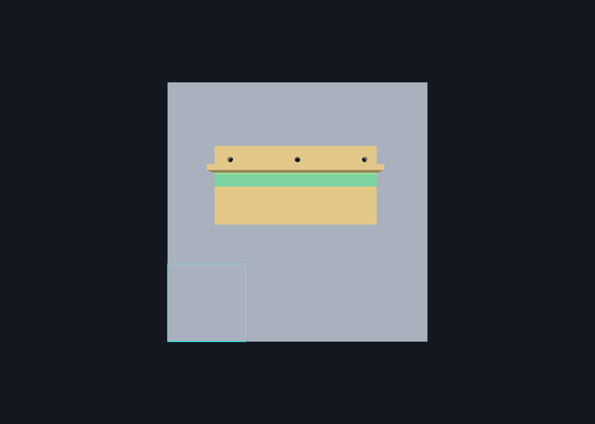

# Spatial content authoring and schema v1

Issue #46 supplies independent Group A content. These assemblies do not reference
Group B, Meta tracking, the prototype, a coordinator or process profiles.
Bootstrap remains unchanged. #49 consumes catalog data; #58 maps immutable
snapshots into training; #66 supplies physical installation evidence.

## Source, authoring and derived assets

| Location | Purpose |
| --- | --- |
| `engineering/cad/source/*.step` | Original engineering exports, outside Unity Assets |
| `engineering/cad/authoring.json` | Versioned fixture/part/marker/binding/tool definitions |
| `engineering/cad/selections.json` | Explicit semantic selection tied to source identity |
| `tools/cad/requirements.txt` | Pinned authoring-only OpenCascade dependencies |
| `tools/cad/inspect_step.py` | B-rep validity, units, solid and face inspection |
| `tools/cad/bake.py`, `author_joint.py` | Tessellation, exact selected edge, clipped bands, metre export and provenance |
| `unity/Assets/Trainer/Content/Spatial/Generated` | Visual JSON, finite geometry JSON and `.spatial` catalog |
| `Content/Spatial/Runtime` | Engine-neutral records, validation, rigid math, immutable snapshots |
| `Content/Spatial/Unity` | Imported ScriptableObject and Unity serialization adapter |
| `Content/Spatial/Editor` | Importer, build validation and independent orbit preview |
| `Content/Spatial/Tests/Editor` | Shared schema cases and Unity import/serialization tests |
| `tests/Spatial.Tests` | Same pure C# cases on .NET 9 without Unity or NuGet dependencies |

The STEP files total less than 80 KB: ordinary Git is appropriate, without LFS.
`.gitattributes` treats STEP as opaque engineering bytes (no text conversion or
line merge) and fixes LF for hashed text.
Never rewrite source headers or line endings. SHA-256 identifies bytes; it does
not authenticate a physical part, author or approval.

## Reproduce the bake

Baseline: Windows x64, CPython 3.12, `cadquery-ocp-novtk==7.9.3.1.1`
(OpenCascade 7.9.3 bindings), pinned proxy package, Unity 6000.3.24f1.
No CAD leaves the machine. Quest never loads STEP, Python or OpenCascade.

```text
python -m venv .venv
.venv/Scripts/python -m pip --isolated install -r tools/cad/requirements.txt
.venv/Scripts/python tools/cad/inspect_step.py
.venv/Scripts/python tools/cad/bake.py
.venv/Scripts/python tools/cad/bake.py --check
dotnet run --project tests/Spatial.Tests -- .
python tests/repository_checks.py
```

Use the actual Python executable when `python` is not on PATH. The local Windows
rebake compares every output byte. Other platforms/kernel versions may
change tessellation ordering: review geometry/provenance before a baseline change.

Import verifies one valid solid and explicit millimetres per source. Meshing is
single-threaded, with absolute chord deflection 0.05 mm and angular deflection
0.1 rad. Normals follow B-rep face orientation. Closed-solid validation checks
paired edge orientation and positive signed volume. Metre components round to
10 decimals (at most 0.05 nanometres per component); unit normal tolerance is
1e-6. Mesher deflection is a requested approximation tolerance, not a measured
physical accuracy or certified Hausdorff bound. Hole walls are faceted; later
scoring tolerances must account for proxy error.

Visual and evaluation artifacts are separate, currently from the same complete
surface triangulation. Holes/recesses are retained instead of infinite planes or
speculative simplified collision proxies. No CAD edge automatically becomes a seam.

The catalog records source SHA-256/revisions, converter/version, axes/pivot,
import poses, unit/deflection settings and visual/geometry hashes. `bakeInputs`
also hashes scripts, requirements, authoring, selections and the owner-evidence record. Snapshot
SHA-256 covers exact UTF-8 catalog bytes including those transitive identities;
geometry hashes cover exact geometry bytes. There is no self-referential hash.
Changes require a rebake and intentional revision review. Editor/build validation
checks original sources; runtime checks packaged artifacts without source CAD.
Repository checks catch changed inputs outside Unity Assets and run the pure
C# suite through the existing GitHub Actions entry point. This requires a stable
.NET SDK 8 or later; it selects the highest installed SDK without adding package
dependencies. The standalone project defaults to the locally verified .NET 9.
Full OpenCascade rebaking is an explicit authoring check, not a claimed CI run.

## Coordinates and marker region

The shared CAD origin remains the Fixture and Workpiece origin. Numeric `(x,y,z)`
components remain unchanged. Identity import rotation/pivot and one multiplication
by `0.001` at STEP geometry export convert mm to m (mesh vertices and selected B-rep edge endpoints each once). No GameObject scale is involved.
Wire rigid scale must equal 1; runtime poses have no scale degree of freedom.
Quaternion order is `(x,y,z,w)`.

The structural convention is `AFromB`, `q*v*q^-1`, ordinary component cross
products, and +90 degrees about +Z mapping +X to +Y. Tests compare this with
Unity's numerical vector/quaternion and primitive mesh conventions. Import
preserves components, outward winding and normals without an additional axis
reflection. #49 separately normalizes MRUK marker axes/origin/dimensions.

For the supplied part, `FixtureFromWorkpiece` is nominal identity based on the
confirmed design, not an inference from matching Y extents. General nonidentity
poses have separate composition/inversion tests.

The region and nominal Marker origin are `(-0.105,0.0076,0.105)` m, with local
+X = Fixture +X, +Y = Fixture -Z, +Z = Fixture +Y. The quaternion is
`(-sqrt(0.5),0,0,sqrt(0.5))`; width/height are 0.09 m. This maps onto pinned
fixture face 14, X [-0.15,-0.06], Z [0.06,0.15]. Surrounding top Y is 0.008 m.
The in-plane orientation is an authored nominal choice, not evidence of an
installed printed label.

Initial `FixtureFromMarker` remains that floor pose, explicitly unqualified.
Known print thickness does not establish the installed marker plane. #66 must
select a print and record installed pose/evidence in a new content revision.

### Alternative print specifications

`MARKER-001` revision 2 owns two immutable `PrintCandidateSnapshot` records
(print schema 1 / revision 1), not two physical markers or assembly bindings:

| Candidate | White label | Thickness | Centered symbol, excluding quiet zone | Payload |
| --- | --- | --- | --- | --- |
| QR-PRINT-A | 90 × 90 mm | 0.1 mm | 53 × 53 mm | LW1:PART-001 |
| QR-PRINT-B | 90 × 90 mm | 0.1 mm | 63 × 63 mm | LW1:PART-001 |

`SelectedPrintCandidateId` is null in snapshots (empty on wire). Legacy marker
dimension fields describe the selected marker only and remain unavailable;
they do not erase the known specifications exposed by `PrintCandidates`.
Candidate payload must match its bound part. IDs, revisions, positive finite
dimensions, centered symbol/margin, convention and mounting footprint validate.
Selection must copy the candidate metadata consistently; selection alone never
qualifies the plane or station. Installed containment checks the whole white
label, not only the smaller symbol. Only one print can occupy the one mount.

No digital QR artwork was supplied. `artworkProvenance=NotSupplied` explicitly
withholds file hashes, module count, version and error correction. The blank
margin cannot establish quiet-zone module compliance without that artwork.
The specification evidence is the owner's recorded instruction, not a print
file or physical accuracy report. #66 compares/selects and physically qualifies.

## Actual approved semantic content

`PART-001` / its geometry, marker, binding and catalog are revision 2; fixture,
mount region, mounting revision and original STEP identities are unchanged.
`FixtureFromWorkpiece` remains identity. The owner selection recorded in
`engineering/cad/semantic-selection.md` resolves the earlier semantic gap.

The directed seam is the single shared straight B-rep edge of workpiece face 4
(horizontal, Y=15.5 mm, outward +Y) and face 13 (upright, Z=-44 mm, outward +Z).
The exact exported endpoints in Workpiece metres are:

```text
start = (-0.09446746641944131, 0.0155, -0.044000000000000025)
end   = ( 0.09027822178886748, 0.0155, -0.04400000000000001)
length = 0.18474568820830878 m
```

Increasing X is left→right from the QR-visible side. The bake selects those
faces explicitly, requires a unique shared straight edge and checks its Y/Z
planes and both outward normals. Endpoints retain B-rep double precision;
triangulated surfaces retain their documented 10-decimal metre rounding.
Segment support IDs identify both finite triangles through `surfaceIds` and
`adjacentSurfaceIds`. Reversing points changes travel direction; it is not an
equivalent serialization. Production tests assert ordered endpoints.
The trailing Z digits are B-rep floating-point representation of the nominal
Z=-44 mm plane, not a measured nonplanarity or a physical precision claim.

Both PreWeld and PostWeld span the full seam X interval. The horizontal strip
is Y=0.0155, Z=[-0.044,-0.029] m; the upright strip is Z=-0.044,
Y=[0.0155,0.0305] m. Sutherland–Hodgman clipping intersects each finite source
triangle with the strip halfspaces, then fan triangulation preserves winding
and support IDs. Area checks require length × 0.015 m on each face. Separate
region IDs/phases share geometry without merging their process meaning.
No hole-side faces or whole-face masks are included. The resulting workpiece
semantic status is `Approved`; the fixture itself has no training targets.

Generic content still supports multiple directed seams, cumulative arc lengths,
finite triangle masks, authoring evidence and an optional second joint support
per segment. Validation rejects missing/nonadjacent support, invalid normals,
out-of-surface segments/masks and missing approved pre/post phases. Source
topology changes require deliberate re-authoring, not automatic weld inference.

## Authoring, preview and fail-closed use

Edit source authoring/selections, bump relevant revisions, bake, then open Unity.
The `.spatial` importer validates and creates `SpatialCatalogAsset` with packaged
JSON and metre Mesh subassets. Unity generates the committed `.meta` files.
Invalid content fails import/build with field/ID diagnostics, without normalization.

Use **Trainer → Spatial → Validate all source and baked content** and
**Trainer → Spatial → Inspect supplied CAD assembly**. The independent preview
uses no scene, coordinator or QR observation. Drag to orbit: grey fixture, gold
workpiece, cyan nominal recess perimeter, green cleaning band and yellow seam. The perimeter gets a display-only
0.05 mm lift against z-fighting. No invented QR artwork is drawn. Both phase masks coincide; the preview displays PreWeld once.
Compare holes, floor/top height, common origin and axes against the source report.



This Unity render uses the canonical top view: mounting holes north, recess
lower-left, and the +Z seam below the upright. **Exact top** resets to +Y view
with -Z north; both buttons and exported image use the same RH CAD camera.
The previous initial view was on the mounting-hole side; Unity default LookAt
also places -X on screen-right in the canonical overhead view, mirroring
the physical CAD interpretation. `CadPreviewView` constructs screen-right as
forward cross up and scopes the corresponding rasterizer-culling parity.
No source, authored coordinates, import, mesh winding or rigid pose was changed.
Projection tests check recess lower-left, holes north, directed seam left→right
and positive view determinant. Ordinary Unity numeric cross/quaternion tests
remain useful but do not prove physical screen chirality. #49 must normalize
physical SDK basis/corner ordering explicitly; never represent reflection by
a rigid quaternion or copy this editor camera into runtime registration.

This render shows nominal CAD and authored semantics. It is not a photographed or
physically qualified installation. Reproduce it with **Trainer → Spatial →
Export nominal CAD preview PNG** (output under ignored `artifacts/`).

`SpatialCatalogAsset.Freeze()` returns a catalog with read-only, defensively
copied collections and vector/quaternion value copies. `ResolveForPreview`
allows inspection of valid unqualified content; `ResolveForScoredRegistration`
rejects unknown/malformed IDs, missing station approval, an unselected print candidate, unknown installed
marker dimensions/plane, or missing workpiece semantics. Duplicate active part bindings reject
the entire catalog. This MVP has one mount per `partId`; no mount key, arbitrary
pose or downloaded configuration is in QR. #49 owns `LW1:partId` parsing/tracking.

Qualification strings are local evidence references, not cryptographic approval.
Physical controller/tool/tip setup is independent of virtual nozzle labels;
unknown offsets cannot be used. #48/#66 supply their measurements.

Valid unqualified assets may build for inspection; the scored-resolution gate
stays closed. #58 must use it, freeze hashes per attempt and retain Group B's
activation gates. This module never grants activation or publishes Registered.

## Verification and physical limits

Run repository/pure tests above. Unity Test Runner can run the
`WeldingTrainer.Content.Spatial.Tests` EditMode assembly, or:

```text
Unity -batchmode -nographics -projectPath unity -runTests -testPlatform EditMode -testFilter WeldingTrainer.Content.Spatial.Tests -testResults artifacts/spatial-editmode.xml -logFile artifacts/spatial-unity.log
```

Tests cover actual source/mesh/proxy hashes and bounds, Unity serialization and
import, contract translations, nontrivial rotations/translations, frame direction,
scale/nonfinite data, IDs/revisions/duplicates, unknown metadata, recess support,
outward normals/closed solids, finite seams/masks, immutable exports and corruption.
The synthetic test assembly is Editor-only, excluded from runtime content.

No automated result measures manufactured dimensions, printed label placement,
thickness/quality, rebolting, controller tip or Quest/anchor errors. #66 requires
physical evidence using #49; #58 owns complete training and Group A/B mapping.
